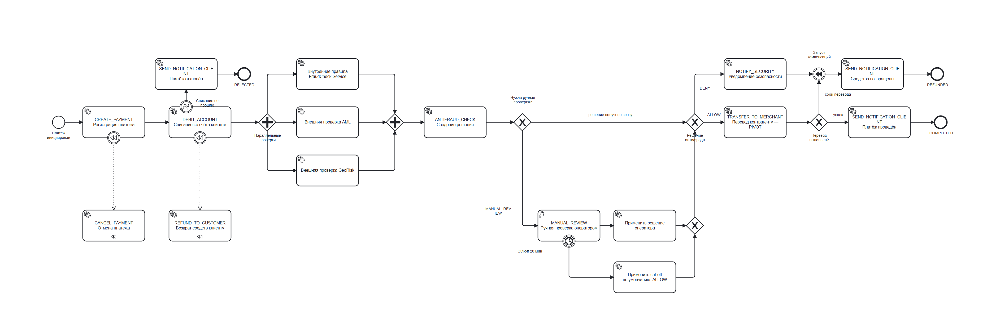

# Task 4. BPMN-диаграмма процесса обработки платежа

Диаграмма построена в Camunda Modeler. Рядом с картинкой лежит исходный [`payment_saga.bpmn`](payment_saga.bpmn) — его можно открыть в Camunda Modeler и в дальнейшем использовать как основу для реализации оркестрации в BPM-движке, как и предполагает задание.

## Как читать диаграмму

- **Успешный путь** — сверху вниз по центральной линии: `CREATE_PAYMENT` → `DEBIT_ACCOUNT` → параллельные проверки → `ANTIFRAUD_CHECK` → `TRANSFER_TO_MERCHANT` (**pivot-точка**, отмечена в названии шага) → `SEND_NOTIFICATION_CLIENT` → `COMPLETED`.
- **Параллельные действия** — параллельный шлюз (`+`) после `DEBIT_ACCOUNT` веерно запускает три независимые проверки (внутренние правила FraudCheck, внешние AML и GeoRisk) и ждёт все три перед сведением решения в `ANTIFRAUD_CHECK`.
- **Развилка на три исхода антифрода** реализована в два шага: сначала эксклюзивный шлюз «Нужна ручная проверка?» отделяет случай `MANUAL_REVIEW` от мгновенного решения, затем оба потока сходятся в шлюзе «Решение антифрода», где `ALLOW` уходит на перевод, а `DENY` — на уведомление безопасности.
- **Ожидание ручной проверки** — `MANUAL_REVIEW` смоделирован как User Task с граничным таймерным событием `Cut-off 20 мин` (`PT20M`). Если оператор успевает принять решение — процесс идёт по обычному потоку из задачи; если нет — таймер прерывает задачу и применяется решение по умолчанию `ALLOW`.
- **Компенсации** показаны двумя способами: `CREATE_PAYMENT` и `DEBIT_ACCOUNT` имеют граничные события компенсации (пунктирная связь вниз к `CANCEL_PAYMENT` и `REFUND_TO_CUSTOMER`), а промежуточное событие «Запуск компенсаций» бросает компенсацию явно — оно достижимо и при отказе антифрода (после `NOTIFY_SECURITY`), и при сбое перевода контрагенту.
- **Автоматические возвраты** — оба входа в «Запуск компенсаций» ведут к `SEND_NOTIFICATION_CLIENT` (уведомление о возврате) и терминальному состоянию `REFUNDED`, без участия Customer Support.
- **Отдельная ветка отказа списания** (верхний левый угол) — граничное событие ошибки на `DEBIT_ACCOUNT`: если средств недостаточно или счёт заблокирован, компенсировать нечего, платёж сразу уходит в `REJECTED`.

## Соответствие остальным артефактам

Имена сервисных задач совпадают с именами шагов из реестра транзакций ([Task1](../Task1)): `CREATE_PAYMENT`, `DEBIT_ACCOUNT`, `ANTIFRAUD_CHECK`, `TRANSFER_TO_MERCHANT`, `SEND_NOTIFICATION_CLIENT`, `REFUND_TO_CUSTOMER`, `CANCEL_PAYMENT`, `NOTIFY_SECURITY`. Развилки и промежуточные состояния диаграммы соответствуют состояниям и переходам из [Task2](../Task2).
